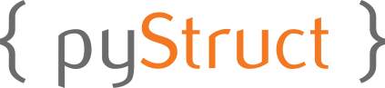

  


>Projeto final da disciplina de compiladores do semestre 2020.1

### Operadores:  

```
+ 
- 
* 
/ 
^ 
++ 
-- 
= 
==
!=  
< 
> 
>= 
<= 
&& 
||
```

### Palavras e símbolos reservados:
```
while
if
else
func
print
{
}
(
)
[
]
;
,
""
''
/*
*/
//
int
str
flt
boo
NULL
true
false
```
### Gramática:
```
<digit> ::= 0|1|2|3|4|5|6|7|8|9
<letter> ::= a|...|z|A|...|Z
<type> ::= int|str|flt|boo
<id> :: (_|<letter>){ <leter>|<digit> }
<program> ::= func main() { <declarations> <comands> }
<declarations> ::= { <declaration> }
<declaration> ::= <type> <id> [  ] { ,<id> } ;
<comands> ::= { <comand> }
<comand> ::= <bloc>|<att>|<op>|<if>|<while>
<bloc> ::= { <comands> }
<att> ::= <id> = <exp>
<if> ::= if(<exp>) { <declarations> <comands> } { else { <declarations> <comands> } }
```
